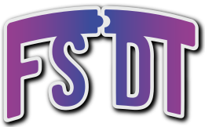

# 🚀 FullStack DevTool

<p align="center">
  <a href="https://fsdt.maxime-p.dev/" target="blank"></a>
</p>

FullStack DevTool is an entirely new type of interactive console that aggregates and **displays logs from multiple source applications** in an organized manner. Previously, a developer working on multiple interdependent applications had to split their attention across multiple interfaces to monitor all the logs. With **FullStack DevTool**, they can now track, organize, and filter them through a single, optimized interface.

FullStack DevTool also holds value for developers working on a single application at a time, as they can benefit from an unprecedented log management system (interactive log categorization, filtering, sorting, etc.).

With FullStack DevTool, there's no need to delete logs once development is complete. You can keep them, as they will never be visible in production and can be easily sorted as needed.

## 📋 Table of Contents

- [Getting Started](#🎬-getting-started)
  - [Prerequisites](#prerequisites)
  - [Installation](#installation)
- [Usage](#🧪-usage)
  - [Use the FSDT logger](#use-the-fsdt-logger)
  - [Configure the FSDT logger](#configure-the-fsdt-logger)
- [Contributing](#✏️-contributing)
- [License](#📖-license)
- [Acknowledgments](#🙏-acknowledgments)

## 🎬 Getting Started

To use this project correctly, follow these steps.

### Prerequisites

- NodeJS

### Installation

```bash
yarn add @fullstack-devtool/sdk
yarn add -D @fullstack-devtool/app
```

### Start

```bash
yarn fullstack-devtool -p <PORT_NUMBER>
```

**<PORT_NUMBER>** is the port that will be used by the server. ⚠️ **It should be defined**.

## 🧪 Usage

### Use the FSDT logger

```typescript
import FsdtLogger from '@fullstack-devtool/sdk'

const logger = new FsdtLogger('test-app-1', {
  port: 1234, // It should be equal to the <PORT_NUMBER>
  connectionType: 'source',
})

logger.info({ myVar: 'myVar' })
```

### Configure the FSDT logger

```typescript
type FsdtServerConfig = {
  port: number // On which the server runs on

  domainName?: string // Default is "localhost"

  connectionType?: 'source' | 'monitor' // Default is source

  useConsole?: boolean // If true, it displays logs in the default console in addition to FSDT console

  disable?: boolean // Disable the connection with the FSDT console (recommended in production)

  printErrors?: boolean // Print the errors (connection errors, ...) (it's false by default)
}
```

### Jest support

If you want to be able to get logs in your Jest environment, you should add the following code in your test file.

```typescript
beforeAll(async () => {
  await logger.waitForConnection() // To wait for the connection being established
})
afterAll(async () => {
  await logger.disconnect() // Disconnect the logger in order to make jest terminate correctly
})
```

> ⚠️ You should create a dedicated file to do so, in `.jest/setup.js` to implement this process for all the test files. In the jest.config.js, you should add the path in the `setupFilesAfterEnv` field. [See more info](https://jestjs.io/docs/configuration#setupfilesafterenv-array).

## ✏️ Contributing

For contributing, please follow the <a href="https://github.com/FullStack-DevTool/FSDT/blob/main/CONTRIBUTING">Contributing instructions</a> from the repository.

## 📖 License

This project is licensed under the MIT License - see the [LICENSE](LICENSE) file for details.

## 🙏 Acknowledgments

We would like to express our gratitude to the following individuals and projects for their contributions and inspiration:

- The [Electron framework](https://github.com/electron/electron), which is the foundation of our desktop application
- The [WebSocket Library](https://github.com/websockets/ws)

Special thanks to the entire open-source community for their continuous support and for providing a rich ecosystem of tools and resources that make projects like this possible.
